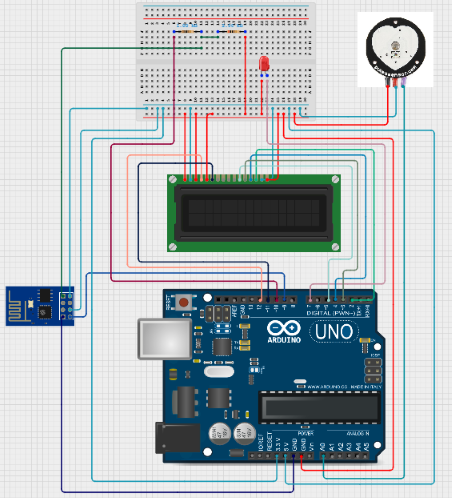

# IoT-Based Pulse Rate Monitoring System with Database Integration and Web Visualization

## Abstract
This IoT-based Pulse Rate Monitoring System enables real-time heart rate monitoring and visualization. Using an Arduino Uno and a pulse sensor, heartbeat data is captured, displayed on a 16x2 I2C LCD, and transmitted via an ESP8266 WiFi module for visualization. The system stores data securely, provides analytics, and categorizes heart rate as 'Normal' or 'Abnormal'. This solution supports remote patient monitoring and facilitates historical data analysis through a user-friendly interface.

**Keywords:** Arduino Uno, ESP8266, Pulse Sensor, LCD Display, IoT, Real-Time Monitoring, Heart Rate Analytics, Web Dashboard

---

## Hardware Components
All hardware components used in the project are listed in [components-list.md](hardware/components-list.md).

---

## Circuit Diagram

  

---

## Libraries
Required libraries and installation instructions are listed in [`libraries.md`](arduino-code/libraries.md).

---

## Software Overview
The system consists of:

- **Arduino Firmware (`arduino-code/pulse_monitor.ino`):**  
  Reads pulse sensor data, calculates BPM, displays it on the LCD, and sends data via the ESP8266 module.  
- **ESP8266 WiFi Module:**  
  Connects to the local network and transmits heart rate data for visualization.  
- **Data Visualization:**  
  Heart rate can be monitored in real time and stored for further analysis. A simple interface/dashboard can be used to view current readings and trends.

---

## Usage Instructions
Follow these steps to set up and monitor the IoT-based pulse rate system:

1. Assemble the hardware according to the circuit diagram. Ensure all connections are secure.  
2. Connect Arduino Uno to your computer via USB.  
3. Open Arduino IDE, load `arduino-code/pulse_monitor.ino`, and upload it to the Arduino.  
4. Make sure all required libraries are installed via Arduino Library Manager.  
5. Update WiFi credentials in the code (`SSID` and `PASS`) for network connectivity.  
6. Power the LCD and LED as per the circuit diagram.  
7. Open the Serial Monitor to verify sensor readings.  
8. Use any preferred lightweight server or tool to log and visualize the incoming pulse rate data.  
9. Access the real-time readings and historical analysis via the chosen visualization method.  
10. Optionally, save previously captured data for analyzing past records.  
11. Ensure both Arduino and ESP8266 are running for seamless monitoring.

Once everything is set up, you can continuously monitor the heart rate in real time and analyze trends over time.

---

## Research Paper
The detailed research paper for this project is available here:  

[IoT-Based Pulse Rate Monitoring System – Research Paper](research-paper/IoT_Based_Pulse_Rate_Monitoring_System.pdf)
